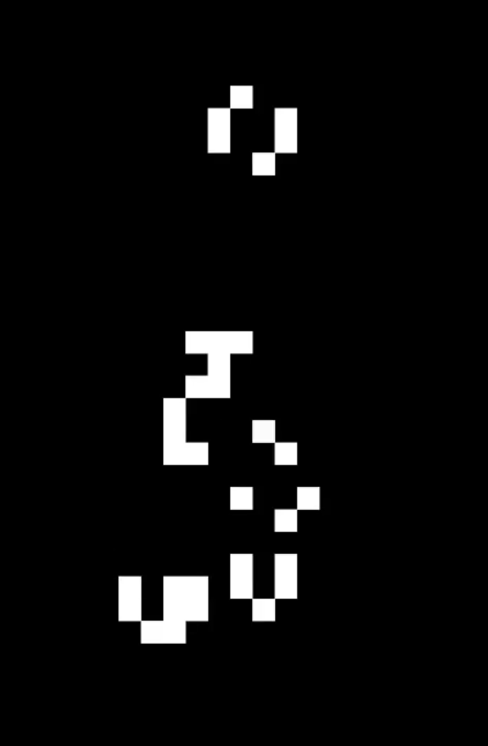

# Juego de la Vida de Conway en Godot

Este proyecto es una implementación del famoso **Juego de la Vida** creado por el matemático John Horton Conway, desarrollado usando el motor de juego **Godot**. 

## Descripción

El Juego de la Vida de Conway es un autómata celular donde cada célula en una cuadrícula puede estar viva o muerta. El estado de las células evoluciona a través de una serie de iteraciones basadas en reglas simples que dependen de los vecinos vivos de cada célula.

## Características

- **Inicialización del Tablero**: Genera una cuadrícula
- **Actualización de Estados**: Actualiza las células vivas y muertas según las reglas del Juego de la Vida.
- **Visualización con TileMap**: Utiliza un TileMap para representar gráficamente las células.

## Requisitos

- **Godot Engine** versión 3.4 o superior.

## Instalación

1. Clona este repositorio:

2. Abre el proyecto en Godot.

3. Ejecuta la escena principal.

## Uso

- Inicia la simulación para ver cómo evolucionan las células vivas y muertas.
- Ajusta los parámetros del juego, como el tamaño del tablero y la velocidad de actualización, según sea necesario.

## Video de Demostración

Mira el video de demostración local para ver cómo funciona el juego:

## Contribuciones

Las contribuciones son bienvenidas. Si deseas contribuir:

1. Haz un fork del proyecto.
2. Crea una nueva rama (`git checkout -b feature-nueva-caracteristica`).
3. Realiza tus cambios y haz commit (`git commit -am 'Añadir nueva característica'`).
4. Empuja tu rama (`git push origin feature-nueva-caracteristica`).
5. Crea un nuevo Pull Request.

## Licencia

Este proyecto está bajo la licencia MIT.

## Créditos

Desarrollado por IacobucciB.

---

¡Gracias por visitar este proyecto! Si tienes alguna pregunta o sugerencia, no dudes en contactarme.
